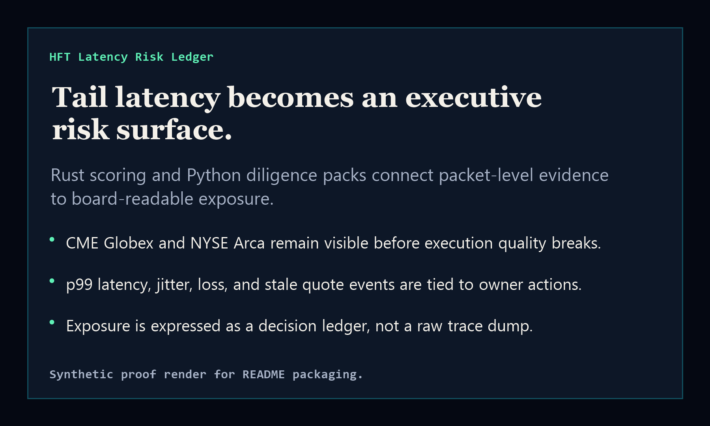
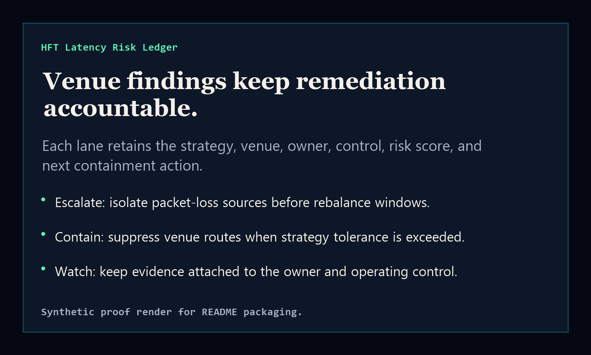

# hft-latency-risk-ledger

[](https://github.com/mizcausevic-dev/hft-latency-risk-ledger/actions/workflows/ci.yml)
[](LICENSE)

Board-ready latency risk ledger for HFT execution exposure, tail latency, jitter, packet loss, stale quote events, and owner-bound remediation posture.

## Why this exists

- HFT latency incidents become executive risk when p99 latency, packet loss, or stale quote events distort execution quality.
- Engineering teams usually see the packet trace, while boards and investors need the owner, exposure, control, and next decision.
- This repo connects Rust scoring, Python diligence packs, and a static executive surface into one reusable operating pattern.

## What it ships

- `Rust` CLI for fast local scoring of venue latency evidence.
- `Python` diligence-pack generator for board and investor review packets.
- `TypeScript` scoring library plus a static HTML surface.
- Fixture-driven validation for p50/p99 latency, jitter, packet loss, stale quote events, notional exposure, and remediation ownership.

## Routes

- `/` executive ledger surface
- `/api/ledger` machine-readable ledger summary when served locally

## Local run

```bash
npm install
npm run verify
npm run prerender
node dist/app.js
```

## Rust CLI

```bash
cargo run --manifest-path crates/hft-ledger-cli/Cargo.toml -- fixtures/hft-latency-sample.json --format json
```

## Python diligence pack

```bash
python python/hft_latency_ledger/pack.py fixtures/hft-latency-sample.json --format markdown
```

## Strategic fit

This is a Kinetic Gain Protocol-aligned FinTech surface: it turns low-level evidence into an executive decision ledger without pretending packet traces are board materials by themselves.

## Screenshots



